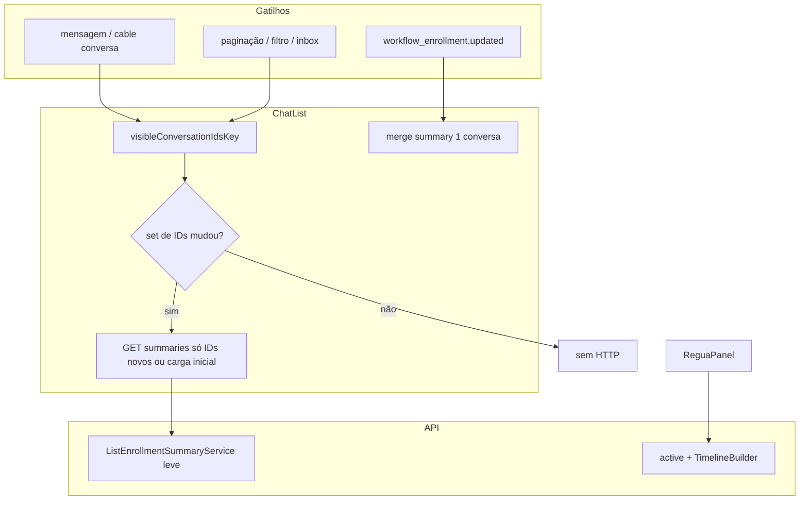

# Plano de correção — Performance inbox / Workflows (Régua)

**Versão:** 1.0  
**Data:** 2026-10-01  
**Status:** Fases 1–3 implementadas no código (validação nginx em produção no deploy)  
**Relacionado:** [performance-lentidao-workflows-inbox.md](./performance-lentidao-workflows-inbox.md)  
**Diagnóstico / loop:** `debug_outputs/performance-workflows-inbox/`

---

## 1. Resumo executivo

A lentidão global em produção foi amplificada por **tráfego HTTP evitável**: o badge de régua na lista de conversas dispara `GET /workflow_enrollment_summaries` (até 50 IDs) em resposta a mutações normais da inbox (mensagens, unread, `last_activity_at`), não só quando enrollments ou a composição da lista mudam. O endpoint executa trabalho pesado (`TimelineBuilder#build`) por enrollment.

**Objetivo:** reduzir o volume de summaries para o patamar de “mudou a lista visível ou mudou um enrollment”, mantendo badge e painel da régua corretos.

**Fora de escopo deste PR:** tuning de `WEB_CONCURRENCY`, Postgres, nginx SSL cache (infra paliativa / follow-up).

---

## 2. Evidência (já comprovada)

| Tipo | Onde |
|------|------|
| Código acoplado | `ChatList.vue` — watcher `deep: true` + refetch em massa |
| Mecanismo Vue 2 | Harness: mutação com IDs fixos → handler dispara |
| Backend pesado | `EnrollmentSummaryService#summary_for` → `TimelineBuilder#step_counts` → `build` |
| Produção (histórico) | ~40% tráfego nginx em summaries (2026-09-25) |

Loop de regressão estrutural (deve ficar **verde** após o fix):

```bash
node debug_outputs/performance-workflows-inbox/verify-structural-bug.mjs
# Hoje: exit 1. Meta pós-fix: exit 0 (ajustar script para refletir novos padrões).
```

---

## 3. Princípios de design

1. **Badge da lista ≠ timeline da conversa** — lista usa dados mínimos; timeline completa só no painel (`/workflow_enrollments/.../active`).
2. **HTTP sob demanda, cable para delta** — o payload de `workflow_enrollment.updated` já contém campos de badge (`EnrollmentPayloadBuilder.for_action_cable`).
3. **Refetch por conjunto de IDs, não por objeto** — comparar set ordenado de IDs visíveis; ignorar mutações in-place em conversas já listadas.
4. **Medir antes/depois** — mesma query nginx / amostra de minutos; registrar no PR.
5. **Mudança mínima** — sem rewrite para Vue 3; sem merge do `chatwoot-develop` (upstream não tem Régua).

---

## 4. Arquitetura alvo



---

## 5. Fases de implementação

### Fase 0 — Preparação (0,5 dia)

| # | Tarefa | Entregável |
|---|--------|------------|
| 0.1 | Branch `fix/inbox-workflow-summary-storm` | — |
| 0.2 | Baseline dev: anotar comportamento atual (DevTools Network na inbox com 1 msg simulada) | screenshot/nota no PR |
| 0.3 | Acordar janela de deploy + rollback (restart `chatwoot-web`) | runbook 1 parágrafo no PR |

**Gate:** nenhum código de prod alterado sem review.

---

### Fase 1 — Frontend: parar o storm (prioridade P0)

**Arquivos:** `ChatList.vue`, opcional helper extraído para teste.

| # | Tarefa | Detalhe |
|---|--------|---------|
| 1.1 | Remover `deep: true` do watcher de `conversationList` | Elimina refetch em `unread_count` / `messages` |
| 1.2 | Introduzir `visibleConversationIdsKey` | Ex.: `ids.join(',')` ou hash estável dos primeiros 50 IDs **na ordem exibida** |
| 1.3 | Watcher só em `visibleConversationIdsKey` | Se igual ao anterior → **return** (zero HTTP) |
| 1.4 | Carga inicial | Manter `fetchEnrollmentSummaries()` no `mounted` quando feature `workflows` ativa |
| 1.5 | Paginação / infinite scroll | Quando IDs novos entram no set, refetch **somente IDs ausentes** em `enrollmentSummaries` (opcional otimização) ou refetch único debounced 300ms **só quando key mudou** |
| 1.6 | `onWorkflowEnrollmentUpdated` | Mapear `payload` → entrada em `enrollmentSummaries[conversation_id]` (mesmo shape do summary atual). Se enrollment cancelado/completed, **remover** chave. **Não** chamar `debouncedFetchEnrollmentSummaries()` para lista inteira |
| 1.7 | Payload cable incompleto | Fallback: `getSummaries([conversationId])` pontual (1 ID), debounce separado por conversa ou dedupe |

**Helper testável (recomendado):**

`app/javascript/dashboard/helper/workflowEnrollmentSummaryFetch.js`

```js
export function shouldFetchEnrollmentSummaries(prevKey, nextKey) {
  return prevKey !== nextKey;
}

export function summaryFromCablePayload(payload) {
  // normalizar enrollment_id, workflow_name, status, labels, step_* 
}
```

**Critérios de aceite Fase 1:**

- [ ] Simular `ADD_MESSAGE` + `UPDATE_CONVERSATION_LAST_ACTIVITY` na inbox: **0** requests `workflow_enrollment_summaries` se IDs visíveis iguais
- [ ] Trocar aba assignee / filtro / scroll que muda IDs: **≤ 1** request debounced por mudança de key
- [ ] Receber `workflow_enrollment.updated`: badge atualiza **sem** refetch de 50 IDs
- [ ] Feature flag `workflows` off: zero calls (comportamento atual preservado)

---

### Fase 2 — Backend: endpoint de lista leve (P0)

**Arquivos:** `enrollment_summary_service.rb`, opcional `list_enrollment_summary_builder.rb`, controller inalterado (mesmo contrato JSON).

| # | Tarefa | Detalhe |
|---|--------|---------|
| 2.1 | Extrair `summary_for_list(enrollment)` | **Sem** `TimelineBuilder#build` |
| 2.2 | Campos mínimos | `enrollment_id`, `workflow_id`, `workflow_name`, `status`, `current_node_label`, `current_node_type` |
| 2.3 | `step_index` / `total_steps` | **Opção A (preferida):** omitir na lista; `ReguaEnrollmentBadge.vue` já trata ausência. **Opção B:** contagem barata (ex. só nós linearizados cached no enrollment) — só se produto exigir “2/5” na lista |
| 2.4 | Manter includes atuais onde necessário | Evitar N+1; não carregar `workflow_step_executions` se não usados na lista |
| 2.5 | Cable / painel | `EnrollmentPayloadBuilder` e `/active` **podem** manter timeline completa |

**Critérios de aceite Fase 2:**

- [ ] RSpec: service não chama `TimelineBuilder#build` no path de lista (spy/mock)
- [ ] Tempo p95 do endpoint cai vs baseline (medir local com 10–20 enrollments, mesmo params)
- [ ] JSON keys compatíveis com frontend atual (sem quebra de badge)

---

### Fase 3 — Regressão automatizada (P1)

| # | Teste | Local |
|---|-------|--------|
| 3.1 | `shouldFetchEnrollmentSummaries` + `summaryFromCablePayload` | Vitest em `helper/specs/` |
| 3.2 | `EnrollmentSummaryService` list path leve | `spec/services/workflows/enrollment_summary_service_spec.rb` (novo) |
| 3.3 | Atualizar `verify-structural-bug.mjs` | Assertir ausência de `deep: true` + presença de key guard |

**Gap documentado:** teste E2E Playwright na inbox é desejável mas não bloqueante se Fase 1+3 unitários passarem.

---

### Fase 4 — Painel `/active` (P2, só se métrica ainda alta)

**Arquivos:** `useWorkflowEnrollment.js`, `ReguaPanel.vue`.

| # | Tarefa |
|---|--------|
| 4.1 | Evitar double-fetch mount + watch imediato (guard `conversationId` unchanged) |
| 4.2 | Após Fase 1.6, painel pode usar channel para refresh parcial em vez de refetch total |

Meta nginx: `/workflow_enrollments/.../active` deixa de ser ~12% se houver spam ao trocar conversa — validar em log pós-deploy.

---

### Fase 5 — Follow-up infra (P3, pós-validação de tráfego)

Portar debounce adaptativo de `conversationStats.js` do `chatwoot-develop` (1s / 7.5s / 15s por tamanho da conta). **Não substitui** Fases 1–2; reduz pressão paralela no Puma.

---

## 6. Validação em produção

Executar **24–48h** após deploy:

```bash
# Participação relativa (ajustar path do log)
tail -n 50000 /var/log/nginx/access.log | grep -c workflow_enrollment_summaries
tail -n 50000 /var/log/nginx/access.log | grep -c 'app.manytalks.com.br'

# Ritmo por minuto
grep workflow_enrollment_summaries /var/log/nginx/access.log | \
  awk '{print $4}' | cut -d: -f1-3 | uniq -c | tail -20
```

| Métrica | Antes (ref) | Meta |
|---------|-------------|------|
| % tráfego summaries | ~40% | ≪ 5% (ordens de magnitude menor) |
| Burst por mensagem WhatsApp | contínuo | nenhum burst se IDs estáveis |
| Badge após step de workflow | correto | via cable ou 1-ID fetch |
| TTFB login sob carga | degradava com fila | estável vs baseline pós-fix |

Registrar números **before/after** no PR e em `debug_outputs/performance-workflows-inbox/status.json`.

---

## 7. Riscos e mitigações

| Risco | Impacto | Mitigação |
|-------|---------|-----------|
| Badge desatualizado se cable falhar | UX | Fallback `getSummaries([id])`; refetch ao mudar key |
| Agente abre inbox antes de cable conectar | Badge vazio até scroll | Fetch inicial no mount (mantido) |
| Remover step X/Y na lista | UX menor | Confirmar com produto; badge ainda mostra label |
| Enrollment scope `contact` | Badge errado em outra conversa | Manter lógica atual de `resolve_conversations` / indexação |
| Fix incompleto (só remove deep) | Storm continua | **Obrigatório** key de IDs (Fase 1.2–1.3) |

---

## 8. Definition of Done

- [ ] Fases 1 e 2 merged com review
- [ ] Vitest + RSpec novos verdes; suite relevante existente verde
- [ ] `verify-structural-bug.mjs` exit 0 (ou substituído por teste Vitest equivalente)
- [ ] PR descreve causa (watcher + endpoint pesado) e números nginx pós-deploy
- [ ] Documento `performance-lentidao-workflows-inbox.md` atualizado: status “corrigido” + data
- [ ] Paliativo `WEB_CONCURRENCY=3` reavaliado após queda de tráfego (opcional, Fase 5)

---

## 9. Sequenciamento sugerido (PRs)

| PR | Conteúdo | Risco |
|----|----------|-------|
| **PR1** | Fase 1 (frontend) + Vitest helper | Médio — maior ganho imediato de tráfego |
| **PR2** | Fase 2 (backend leve) + RSpec | Baixo/médio — complementa PR1 |
| **PR3** | Fase 4 + conversationStats (opcional) | Baixo |

PR1 pode ir sozinho se backend leve atrasar; endpoint pesado ainda será chamado **menos vezes**.

---

## 10. Estimativa

| Fase | Esforço dev |
|------|-------------|
| 0 + 1 | 1–2 dias |
| 2 + 3 | 1 dia |
| 4 | 0,5 dia |
| Validação ops | 0,5 dia (paralelo) |

**Total:** ~3 dias úteis para correção completa com testes e validação.

---

## 11. Aprovação (safe-debug)

Implementação **não** deve começar sem:

1. Ack explícito do time (produto + backend + frontend)  
2. Branch / savepoint  
3. Janela de deploy acordada  

Plano técnico detalhado de patch mínimo: `debug_outputs/performance-workflows-inbox/PATCH_PLAN.md`.
